# 第八章：移动Web开发

**flex 青蛙小游戏** 

- 外网：[https://flexboxfroggy.com/](https://flexboxfroggy.com/)
- 中文网：[https://www.css88.com/tool/flexboxfroggy/#zh-cn](https://www.css88.com/tool/flexboxfroggy/#zh-cn)

## Flex 布局

> 布局模型、避免浮动脱标问题。

```css
display: flex;
```

**设置方式：**给父元素添加 `display: flex;` 子元素可以自动的挤压或拉伸。

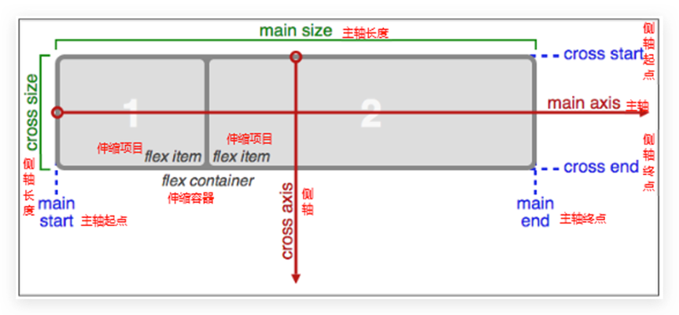


### 主侧轴方向

> 解决盒子排列方向问题。
>
> **默认水平方向是主轴，垂直方向是侧轴。** 

**项目始终跟着主轴进行排列，使用 `flex-direction` 来修改谁是主轴。** 

```css
flex-direction: row;	/* 默认水平方向是主轴：水平排列 */
flex-direction: column;	/* 修改垂直方向为主轴：垂直排列 */
```

|     属性值     |        作用        |
| :------------: | :----------------: |
|      row       | 行，水平（默认值） |
|     column     |      列，垂直      |
|  row-reverse   |    行，从右到左    |
| column-reverse |    列，从下到上    |

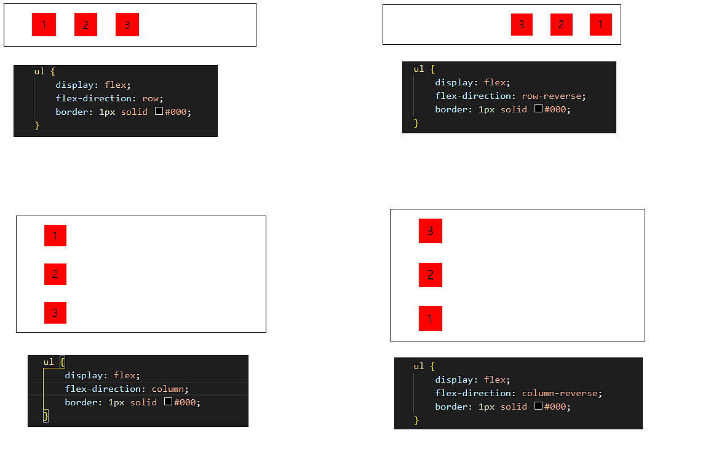


### 对齐方式

> 解决盒子排列位置问题。

#### 主轴对齐方式

```css
justify-content: flex-start;	/* 默认值：起点开始依次排序 */
```

|    属性值     |                       作用                       |
| :-----------: | :----------------------------------------------: |
|  flex-start   |             默认值，起点开始依次排列             |
|   flex-end    |                 重点开始依次排序                 |
|    center     |                  沿主轴居中排列                  |
| space-around  |  弹性盒沿主轴均匀排序，空白间距均分在弹性盒两侧  |
| space-between | 弹性盒沿主轴均匀排序，空白间距均分在相邻盒子之间 |
| space-evenly  |  弹性盒沿主轴均匀排序，弹性盒与容器之间间距相等  |


#### 侧轴对齐方式

```css
align-items: flex-start;	/* 默认值：起点开始依次排序 */
```

|   属性值   |                  作用                  |
| :--------: | :------------------------------------: |
| flex-start |        默认值：起点开始依次排序        |
|  flex-end  |            重点开始依次排序            |
|   center   |             沿侧轴居中排序             |
|  stretch   | 默认值，弹性盒沿主轴线被拉伸至铺满容器 |

```css
align-self: flex-start;
```

>**（设置给子元素）** 可以单独控制其在侧轴的对齐方式，属性值和 `align-items` 一样。


### 弹性盒换行

> 解决盒子换行问题。
>
> 默认值是 nowrap不换行。

```css
flex-wrap: wrap;
```

#### 调整独立行对齐方式

```css
align-content: space-between;
```

|    属性值     |                       作用                       |
| :-----------: | :----------------------------------------------: |
|  flex-start   |             默认值，起点开始依次排列             |
|   flex-end    |                 重点开始依次排序                 |
|    center     |                  沿主轴居中排列                  |
| space-around  |  弹性盒沿主轴均匀排序，空白间距均分在弹性盒两侧  |
| space-between | 弹性盒沿主轴均匀排序，空白间距均分在相邻盒子之间 |
| space-evenly  |  弹性盒沿主轴均匀排序，弹性盒与容器之间间距相等  |


### 排列顺序

> order 默认值是0，排序顺序是从小到大。
>
> 设置给项目，不是给容器。

```css
order: 1;
```


### 伸缩比

> 解决盒子尺寸问题。

#### 扩充

> 用数值来定义扩展比率。不允许负值。
>
> 设置 flex 项目扩充，默认是0不扩充。
>
> 数值是份数，计算公式是：盒子留白的宽度 / 所有份数和，计算每一份再进行比例计算。

```css
flex-grow: 0;
```

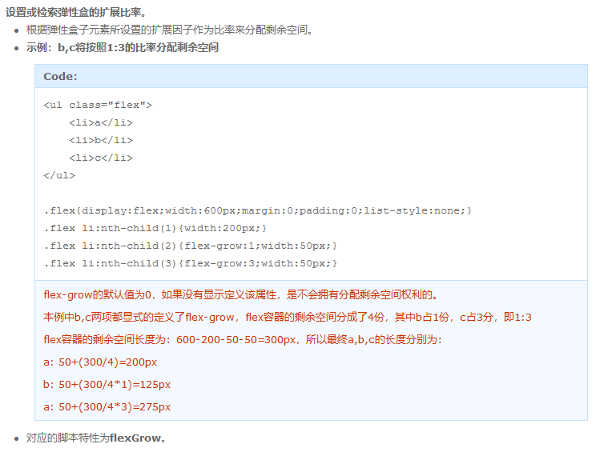


#### 压缩

>用数值来定义收缩比率。不允许负值。
>
>默认值是1，用于给子项设置。

```css
flex-shrink: 1;
```

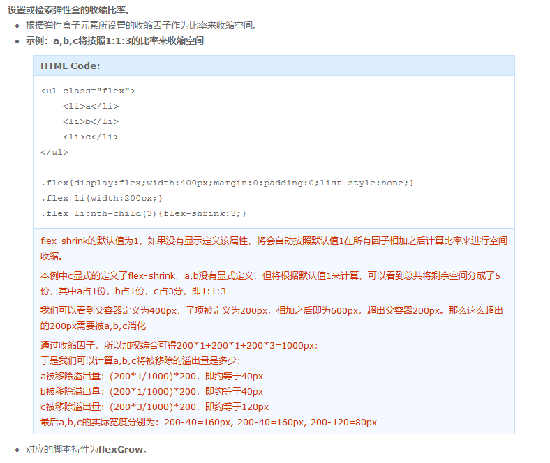


### flex-basis

> 设置或检索弹性盒伸缩基准值。
>
> 如果所有子元素的基准值之和大于剩余空间，则会根据每项设置的基准值，按比率伸缩剩余空间。

|   属性值   |              说明              |
| :--------: | :----------------------------: |
|   length   | 用长度值来定义宽度。不允许负值 |
| percentage | 用百分比来定义宽度。不允许负值 |
|    auto    | 无特定宽度值，取决于其它属性值 |
|  content   |      基于内容自动计算宽度      |


### 简写

```css
/ 语法格式:
flex: 放大 缩小 伸缩项宽度;
flex: flex-grow flex-shrink flex-basis;

flex: 1 0 100px;
```


## 移动端适配

### 长度单位

#### 像素

> 单位：px
>
> 不会随着视口的大小变化而变化，像素是一个固定的 (绝对) 单位。


#### 百分比

> 单位：%
>
> 动态单位，永远跟着元素的父元素作为参考进行计算。
>
> **注意：**
>
> - 子元素高度是参照父元素高度计算的。
> - **子元素 padding 和 margin 无论是水平还是垂直方向，都是参考父元素宽度计算的。**
> - 不能用百分比设置元素的 border。


#### em

> 单位：em
>
> 动态单位，会随着参考元素字体大小的变化而变化（相对单位）。
>
> 注意：
>
> - 当前元素设置了字体大小，那么就相当于当前元素的字体大小。
> - 当前元素没有设置字体大小，那么就相当于第一个设置字体大小的祖先元素的字体大小。
> - 如果当前元素和所有祖先元素都没有设置大小，那么久相当于浏览器默认的字体大小。


#### rem

> 单位：rem
>
> 动态单位，会随着 html 根元素字体大小的变化而变化（相对单位）。


#### vw 和 vh

> 动态单位，会随着网页视口大小的变化而变化（相对单位）。
>
> 系统会将视口的宽度和高度分为100份，1vw 就占用视口宽度的百分之一，1vh 就占用视口高度的百分之一。
>
> 区别：
>
> - 百分比永远都是以父元素作为参考。vw 和 vh 永远都是以视口作为参考。
>
> 旋转之后，跟随屏幕旋转。

#### vmin 和 vmax

- vmin：vw 和 vh 中较小的那个

- vmax：vw 和 vh 中较大的那个

> ==**使用场景：保证移动开发中屏幕旋转之后尺寸不变。**== 


## 视口

> 浏览器可视区大小。
>
> - 在PC端，视口大小就是浏览器窗口可视区域的大小。
>
> - 在移动端，视口大小并不等于窗口大小，移动端视口宽度被人为定义为 980。

移动端自动将宽度设置为980之后，可以看到整个网页。

但是由于移动端的物理尺寸（设备宽度）是远远小于视口宽度的。

所以为了能够在较小的范围内看到视口所有的内容，那么久必须将内容缩小。


### 移动端不自动缩放网页的尺寸

```html
<meta name="viewport" content="width=device-width, initial-scale=1.0 user-scalable=no maximum-scale=no" />
```

|              属性              |            说明            |
| :----------------------------: | :------------------------: |
|       width=device-width       | 设置视口宽度等于设备的宽度 |
|       initial-scale=1.0        |   初始缩放比例，1不缩放    |
|         maximum-scale          |  允许用户缩放到的最大比例  |
|         minimum-scale          |   允许用户缩放到最小比例   |
|         user-scalable          |    用户是否可以手动缩放    |
| viewport-fit: contain 或 cover |   视口适配，兼容刘海屏。   |


## 屏幕尺寸

屏幕对角线的长度，一般用英寸来度量。

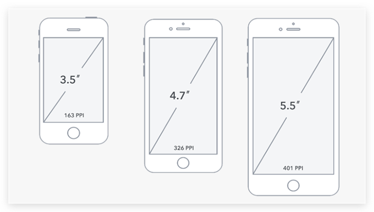


## 分辨率和像素

### 分辨率分类：

- 物理分辨率 是生产屏幕时就固定的，它是不可被改变的。

- 显示分辨率 是由软件（驱动）决定的。


### 像素分类：

- 物理像素：描述物理分辨率使用的像素。

- 独立像素：描述显示分辨率所用到的像素。

注意：

==物理像素纯粹是衡量屏幕质量的单位，与开发无关。== 

==开发网页注重内容的显示，它使用的是独立像素或显示像素。== 


## CSS像素和设备像

PC端

- 1个css像素对应电脑屏幕的1个物理像素。

移动端

- 最开始是1个css像素对应电脑屏幕的1个物理像素。
- 从 iPhone4 开始，乔布斯推出了所谓的 retina 视网膜屏幕，出现了 1个css像素占用2个物理像素。


## 二倍图

> 作用：图片分辨率，为了高分辨率下图片不会模糊失真。

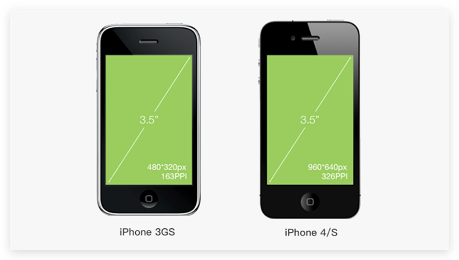


## 媒体查询

响应式布局的核心，能够检测视口的宽度，然后编写差异化的 css 样式调整网页的布局方式。

**响应式布局原理：根据 UI 设计稿需求合理设置响应断点，配合媒体查询书写差异化CSS样式。** 

>响应断点是指媒体查询所采用的视口的宽度。作用：将屏幕尺寸划分成若干的区间。


### 语法格式

```css
/* 写法一：内嵌式 */
@media 逻辑符 媒体类型 and (媒体特性) {
    执行的 css 代码
}

/* 写法二：外链式 */
<link rel="stylesheet" media="逻辑符 媒体类型 and (媒体特性)" href="xx.css" >
```

```css
/* 视口宽度最小为320px，最大为640px时，呈现样式 */
@media (min-width: 320px) and (max-width: 640px) {
    body {
        background: #f00;
    }
}

/* 视口宽度最小为640px，最大为1024px时，呈现样式 */
@media (min-width: 640px) and (max-width: 1024px) {
    body {
        background: #00f;
    }
}

/* 视口宽度最小为1024px，最大为1600px时，呈现样式 */
@media (min-width: 1024px) and (max-width: 1600px) {
    body {
        background: #0f0;
    }
}
```

### @media 解析过程

浏览器解读代码时，实时对当前设备进行检测

- 如果条件满足 (表达式结果为 true )，那么久应用这条 `@media` 规则对应的样式。
- 如果条件不满足 (表达式结果为 false )，{} 内的CSS就被忽略。

### 注意事项

==**@media 样式要放在默认样式的后面**，根据css特性，后面的样式会覆盖前面的样式。== 

- 若媒体特性使用 min-width 时：媒体查询从小到大书写。

- 若媒体特性使用 max-width 时：媒体查询从大到小书写。

```html
<html>
    <head>
        <!-- 默认样式 -->
        <link rel="stylesheet" href="css/index.css" />
        <style> 当前默认样式 </style>
        
        <!-- media 样式 -->
        <link rel="stylesheet" media="(min-width: 320px) and (max-width: 640px)" href="css/media.css" />
    </head>
    <body></body>
</html>
```


### 媒体类型及特性

| 类型名称   | 值     | 描述                    |
| ---------- | :----- | ----------------------- |
| 屏幕       | screen | 带屏幕的设备            |
| 打印预览   | print  | 打印预览模式            |
| 阅读器     | speech | 屏幕阅读模式            |
| 不区分类型 | all    | 默认值，包括以上3种情形 |

```css
@media screen and (min-width: 1024px) and (max-width: 1600px) {
    body {
        background: #0f0;
    }
}
```


| 特性名称       | 属性                  | 值                                   |
| -------------- | --------------------- | ------------------------------------ |
| 视口的宽和高   | width、height         | 数值                                 |
| 视口最大宽或高 | max-width、max-height | 数值                                 |
| 视口最小宽或高 | min-width、min-height | 数值                                 |
| **屏幕方向**   | **orientation**       | **portrait: 竖屏   landscape: 横屏** |

### 横竖屏

```css
/* 横屏 */
@media (orientation: landscape) {
    h1::before {
        content: '现在是横屏状态';
        color: #f00;
    }
}

/* 竖屏*/
@media (orientation: portrait) {
    h1::before {
        content: '现在是竖屏状态';
        color: #00f;
    }
}
```


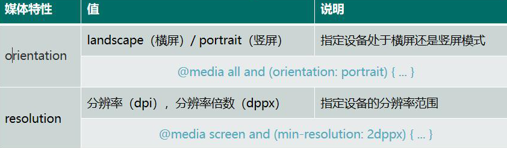

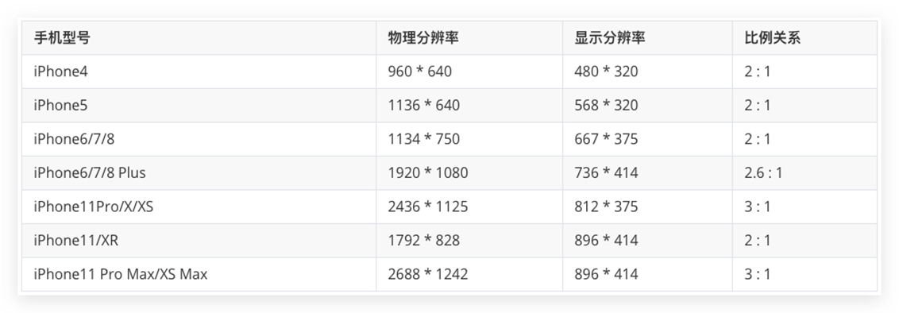

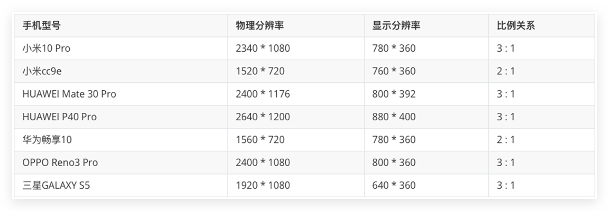


```css
@media (resolution: 2dppx) {
    h1::after {
        content: '2倍屏';
        color: #f00;
    }
}

@media (resolution: 3dppx) {
    h1::after {
        content: '3倍屏';
        color: #00f;
    }
}
```

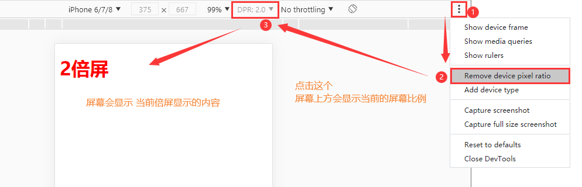

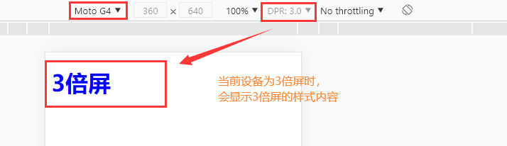


## 手机端和PC端识别

### 判断是否为移动端

> 通过正则判断是否为移动端

```javascript
function idApp () {
    // 是否是苹果
    if (/iphone/i.test(navigator.userAgent)) {
        return true;
    }
    
   	// 是否是安卓
    if (/android/i.test(navigator.userAgent)) {
        return true;
    }
    
    // 是否是 windows phone
    if (/windows phone/i.test(navigator.userAgent)) {
        return true;
    }
    
    return false;
}

// 如果是移动端就跳转到移动端页面
if (isApp()) {
    location.href = 'https://m.js.com/';
} else {	// 否则就跳转到PC端页面
    location.href = 'https://www.js.com/';
}
```


## Less

> css 预处理器，后缀名为 `.less`。
>
> **less 代码无法被浏览器识别，实际开发需要转换成 css，使用 liink 标签引入 css 文件。**


### 插件工具

#### Easy Less

> VS Code 内置插件（less 文件保存自动生成 css 文件）

**更改编译后 css 存储路径** 

- 设置 -- 搜索less -- Easy LESS:compile
- settings.json 中编辑 -- “out” : “../css/”


#### Koala 工具 (了解)

考拉客户端：http://koala-app.com/index-zh.html

在线将 less 文件转为 css 文件。


### Less 语法

> 单行注释不会被编译。


#### 变量

> 和 javascript 一样，也有局部变量和全局变量。
>
> - 定义在 {} 外面的就是全局变量，可以在任意地方使用。
> - 定义在 {} 里面的就是局部变量，只能在 {} 中使用。

```less
// 定义变量：
@变量名: 值;
@width: 200px;

// 使用变量：
css属性: @变量名;
width: @width;
```


#### 插值变量

属性名称或者选择器名称都可以使用变量。

```less
// 语法格式：
@{变量名称};

// 实例：
@width: 800px;
@w: width;
// 调用：
@w: @width;
```


#### less 运算

> 支持 `+ - * /` 运算。

```less
@w: 200px;
@h: 200px;

.father {
    width: @w;
    height: @h;
    background: #f00;
    position: absolute;
    top: 50%;
    left: 50%;
    // css3 新特性 存在兼容性问题
    // transform: translate(-50%， -50%);
    margin-top: -(@w / 2);
    margin-left: -(@h / 2);
    
    .son {
        width: 100px;
        height: 100px;
        background: #00f;
        position: absolute;
        top: 50%;
        left: 50%;
        margin-top: -(100px / 2);
        margin-left: -(100px / 2);
    }
}
```


### calc 方法

> calc() 函数用于动态计算长度值。

```less
@w: 200px;
@h: 200px;

.father {
    width: @w;
    height: @h;
    background: #f00;
    position: absolute;
    top: 50%;
    left: 50%;
    margin-top: calc(-@w / 2);
    margin-left: calc(-@w / 2);
}
```


### 混合

> 将代码打包到一起，提高复用性，本质就是：CV。
>
> 注意：
>
> - 如果混合名称后面没有 {}，预处理时会保留混合的代码。
> - 如果混合名称后面加上 {}，预处理时不会保留混合的代码。

定义一个 `.center`，再通过 `.center()` 进行调用。

```less
.center {
    position： absolute;
    top: 50%;
    left: 50%;
    transition: translate(-50%, -50%);
}

.father {
    width: 200px;
    height: 200px;
    background: #f00;
    .center();
    
    .son {
        width:100px;
        height:100px;
        background: #00f;
        .center();
    }
}
```


### 带参数的混合

> 参数可以有默认值。

```less
@num: 50px;

// 1.打包
.radius (@num: 100px) {
    -webkit-border-radius: @num;
    -moz-border-radius: @num;
    -o-border-radius: @num;
    -ms-border-radius: @num;
    border-radius: @num;
}

// 2.调用
p {
    .radius(@num);
}
```


### 可变参数

> 类似 js 中的 arguments，可以拿到传递进来的所有形参。

```less
// 语法格式：
@arguments
```

```less
.animate(@ name, @time, @mode, @delay) {
    transition: @arguments;
}

div {
    .animate(all, 2s, linear, 3s);
}
```


### 展开运算符

> 如果形参使用了 `...`，那么必须写在形参列表最后。
>
> 当参数数量不确定 或者 部分参数可传可不传时 使用。

```less
// @name 和 @time 是必传的参数，其他参数可传可不传。
.animate(@name, @time, ...) {
    transition: @arguments;
}

div {
    .animate(all, 2s, linear, 3s);
}
```


### 匹配模式

> 通过混合的第一个字符串形参，来确定具体要执行哪一个同名混合。

```less
// 上三角
.triangle ('up', @width, @color) {
    width: 0;
    height: 0;
    border-style: solid;
    border-width: @width;
    border-color: @color transparent transparent transparent;
}
// 右三角
.triangle (right, @width, @color) {
    width: 0;
    height: 0;
    border-style: solid;
    border-width: @width;
    border-color: transparent @color transparent transparent;
}
// 下三角
.triangle ('bottom', @width, @color) {
    width: 0;
    height: 0;
    border-style: solid;
    border-width: @width;
    border-color: transparent transparent @color transparent;
}
// 左三角
.triangle ('left', @width, @color) {
    width: 0;
    height: 0;
    border-style: solid;
    border-width: @width;
    border-color: transparent transparent transparent @color;
}

// 调用，匹配 up
div {
    .triangle('up', @width: 40px, @color: #f00);
}
```

### 通用匹配模式

> 无论同名的哪一个混合被匹配了，都会先执行通用匹配模式中的代码。

```less
// 抽出通用匹配样式
.triangle (@_, @width, @color) {
    width: 0;
    height: 0;
    border-style: solid;
    border-width: @width;
}

// 上三角
.triangle ('up', @width, @color) {
    border-color: @color transparent transparent transparent;
}
// 右三角
.triangle (right, @width, @color) {
    border-color: transparent @color transparent transparent;
}
// 下三角
.triangle ('bottom', @width, @color) {
    border-color: transparent transparent @color transparent;
}
// 左三角
.triangle ('left', @width, @color) {
    border-color: transparent transparent transparent @color;
}

// 调用，匹配 up
div {
    .triangle('up', @width: 40px, @color: #f00);
}
```


### less 导入

类似于模块化思想，解决 less 文件依赖，复用问题。

>**导入后可以直接调用该文件内写好的样式。** 

#### 导入

> 独立 Less 文件之间相互引用，可以省略 `.less` 后缀。

```less
@import "路径";
```

#### 禁止导入

> 在 less 文件第一行添加 `outL false` 。

```less
out: false;
```


### less 内置方法

> less 的底层是 javascript 实现的。

#### 字符串替换

```less
// 语法格式：
replce(“原字符串”, “要替换的参数”, “替换后的参数”);

replce(“abc”, “a”, “p”);	// pbc
```

#### 判断类型

| 说明               | 语法                | 结果 |
| :----------------- | :------------------ | :--: |
| 判断是否包含数字   | isnumber(56px);     | true |
| 判断是否包含字符   | isstring(“string”); | true |
| 判断是否包含颜色   | iscolor(#f00);      | true |
| 判断是否包含像素   | ispixel(56px);      | true |
| 判断是否包含em     | isem(7em);          | true |
| 判断是否包含百分比 | ispercentage(8%);   | true |

#### 颜色操作

| 说明       | 语法                    |
| ---------- | ----------------------- |
| 增加饱和度 | saturate(color, 20%);   |
| 减少饱和度 | desaturate(color, 20%); |
| 增加亮度   | lighten(color, 20%);    |
| 减少亮度   | darken(color, 20%);     |
| 降低透明度 | fadein(color, 20%);     |

```less
div {
    width: 200px;
    height: 200px;
    background: rgb(234, 233, 212);
}

div:hover {
    width: 200px;
    height: 200px;
    // 减少饱和度
    background: desaturate(rgb(234, 233, 212), 20%);
}
```


### 层级结构

`&` 符号表示对父选择器的引用

- 结合伪类使用，如：`:before`。
- 结合伪元素使用，如：`:hover`。

```less
.father {
    .son {
        & {不生成后代关系，表示当前选择器，方便代码迁移}
    }
}
```

```less
.son {
    &::before {
        content: '新增内容';
    }
    &:hover {
        color: #f00;
    }
}
```

`:before` 不可以添加 `:hover` 效果，伪类对不生效。


### less 继承

> 类似于 js 中的继承，方便代码复用，便于代码维护。

```less
// 语法格式：
.类名:expend(父类);
```

```less
.center {
    position： absolute;
    top: 50%;
    left: 50%;
    transition: translate(-50%, -50%);
}

.father:expend(.center) {
    width: 200px;
    height: 200px;
    background: #f00;
    
    .son:expend(.center) {
        width:100px;
        height:100px;
        background: #00f;
    }
}
```

less 中的继承 和 less 中混合的区别：

1. 使用时的语法格式不同。

   混合：`.类名()` 

   继承：`:expend(父类)` 

2. 转换后的结果不同（混合是直接可拷贝，继承是并集选择器）

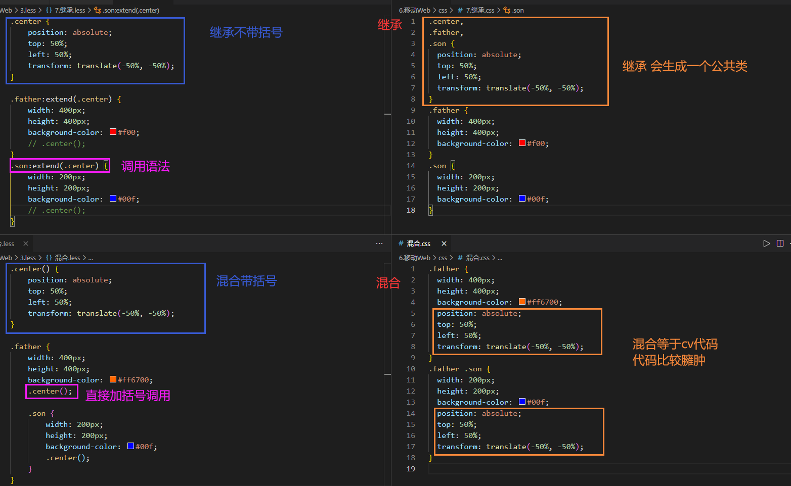


### less 条件判断

> less 中通过 when 给混合添加限定条件，满足才会执行混合中的代码。
>
> when 中可以使用比较运算符(>  <  >=  <=  =)、逻辑运算符 或 函数来进行判断。
>
> - and：并且
> - `,` ：或者
>
> ==条件中除了可以使用比较运算符，还可以使用内置方法。== 

```less
// 并且
.size1 (@w, @h) when (@w = 400px) and (@h = 400px) {
    width: @w;
    height:@h;
}
// 或者
.size2 (@w, @h) when (@w = 400px), (@h = 400px) {
    width: @w;
    height:@h;
}
// 内置方法
.size3 (@w, @c) when (iscolor(@c)) and (@w = 100%) {
    width: @w;
    color: @c;
}

div {
    .size1(300px, 400px);	// false
    .size2(300px, 400px);	// true
    .size3(#f00, 100%);		// true
}
```


## 案例：京东 - 两列布局

```less
.commodity {
    width: 100%;
    overflow: hidden;
    padding: 5px;
    
    .item {
        float: left;
        width: 50%;
        box-sizing: border-box;
        margin-bottom: 8px;
    }
    
    .item:nth-child(odd) {
        padding-right: 2.5px;
    }
    .item:nth-child(even) {
        padding-left: 2.5px;
    }
}
```


## IIS 本地服务部署

> Internet Information Services (IIS) 管理器，用于本地起服务，可在局域网内访问本地网站。

### 启用服务

控制面板  =>  程序和功能  =>  启用或关闭 Windows 功能  =>  Internet Information Services  =>  全部勾选。

### 部署网站

1. 按 win 键，搜索 IIS。
2. 点击左侧网站，创建网站。
3. 配置名称、网站地址、IP 地址。
4. 配置完成，找到配置好的网站，点击右侧的启动。


## flexble.js 移动端兼容

GitHub下载地址：[https://github.com/amfe/lib-flexible/tree/master](https://github.com/amfe/lib-flexible/tree/master)

> 阿里团队开源的一个 js 库，使用 flexible.js 轻松搞定各种不同的移动端设备兼容自适应问题。

**原理：**为不同的移动设备设置不同的根字号大小，从而利用 rem 布局原理兼容不同的移动端设备自适应问题。

### 使用

<a href="http://wangsir.info/downFile/lib-flexible-2.0.zip" download="http://wangsir.info/downFile/lib-flexible-2.0.zip">lib-flexible-2.0.zip</a>

> 在 head 中引入 flexble.js 文件，不同设备 设置 html 根字体大小。

```html
<html style="font-size: 50px;">
    <head>
        <sctipt src="./flexble.js"></sctipt>
    </head>
</html>
```

