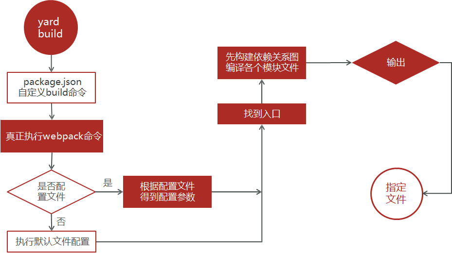

# 第九章：Webpack

官网网址：[https://webpack.docschina.org/](https://webpack.docschina.org/)

减少文件数量，缩减代码体积，提高浏览器打开速度。

用于分析、并打包代码。支持所有类型文件的打包，其本质是一个第三方模块包。


## 配置环境

1. 初始化包环境

   ```cmd
   yarn init
   ```

2. 安装依赖包

   ```cmd
   yarn add webpack webpack-cli -D
   ```

3. 配置package.json 的 scripts（自定义命令）

   ```js
   "scripts": {
       "build": "webpack"
   }
   ```


## 打包文件

在根目录下新建 src 文件夹，**所有要打包的文件都要放在 src 文件夹下。** 

在 src 文件夹下，新建 add 文件夹，并在其下面新建要打包的 add.js 文件。

```js
// src/add/add.js
function add (a, b) {
    return a + b;
}

// 导出
module.exports = {
    add,
}
```

在 add 的同级目录下，新建 sum 文件夹，并在其下面新建要打包的 sum.js 文件。

```js
// src/sum.sum.js
function sum (arr) {
    let sum = 0;
    for (let i = 0; i < arr.length; i++) {
        sum += arr[i];
    }
    return sum;
}

// 导出
module.exports = {
    sum,
}
```

在 src 下新建 index.js 入口文件（默认入口文件为 src/index.js）

```js
// src/index.js

// 导入
let add = require('./add/add');
let sum = require('./sum/sum');

// 引用
console.log(add(10, 20));	// 30
```


## 打包命令

```cmd
yarn build
```

打包后，会在根目录生成 dist 目录，并生成 main.js 出口文件（main.js 就是打包会后的文件）。

### 执行流程

> 所有要被打包的资源都要跟入口产生直接 / 间接的引用关系。




## package.json 配置文件

```js
{
   "scripts": {
      "build": "webpack",
      "server": "webpack server"
   },
}
```

**自定义打包命令**：`"build": "webpack",`

```cmd
# 打包命令
yarn build
```

**webpack 开发服务器**：`"server": "webpack server"` 

> 启动服务后，自动打包文件。不需要每次执行 `yarn build` 重新进行打包。

- 安装依赖包

  ```cmd
  yarn add webpack-dev-server -D
  ```

- 启动服务器

  ```cmd
  yarn serve
  ```

  

## webpack.config.js 配置文件

在 src 同级目录下新建 `webpack.config.js` 配置文件。

- 配置端口号

  ```js
  devServer: {
      port: 3000
  }
  ```

- mode：配置当前环境

  - 开发环境：development
  - 生产环境：production

- entry：入口文件

  > 要打包的文件。

- output：出口文件

  > 打包后生成的文件。

- plugins：配置插件

  - **HtmlWebpackPlugin** 

    - 安装

      ```cmd
      yarn add html-webpack-plugin -D
      ```

    - 配置

      ```js
      new HtmlWebpackPlugin({
          template: './public/index.html'
      })
      ```

- module：配置 loader

  - rules：配置规则

    - **打包 css 文件** 

      >css-loader 将css文件一起打包到 js 中
      >
      >style-loader 将 css 插入到DOM (style标签) 上

      ```js
      {
          test: /\.css$/i,
          use: ['style-loader', 'css-loader']
      }
      ```

    - **打包 img 图片** 

      小于8KB，文件转base64打包在js中。大于8KB，自动命名输出到dist下。

      ```js
      {
          test: /\.(png|jpg|jpeg|gif)$/i,
      	type: 'asset'
      }
      ```

    - **打包 less 文件** 

      ```cmd
      # 安装依赖包
      yarn add less less-loader -D
      ```

      配置文件

      ```js
      {
          test: /\.less$/,
      	use: ["style-loader", "css-loader", "less-loader"]
      },
      ```

    - 对 js 语法进行降级处理，兼容低版本

      ```cmd
      # 安装依赖包
      yarn add babel-loader @babel/core
      ```

      ```js
      {
          test: '/\.js$/',
      	exclude: /(node_modules|bower_components)/,
      		use: {
      		loader: 'babel-loader',
      		options: {
      			presets: ['@babel/preset-env']
              }
      	}
      }
      ```

      

```js
module.exports = {
    // 配置端口号
    devServer: {
        port: 3000
    }
    // 配置开发环境还是生产环境
    mode: 'development',
    // 自定义入口文件
    entry: '/src/main.js',
    // 自定义出口文件
    output: {
        pash: pash.json(_dirname, 'dist');
        filename: 'bundle.js'
    },
    // 配置插件
    plugins: [
        new HtmlWebpackPlugin({
            template: './public/index.html'
        })
    ],
    // 配置 loader
    module: {
        // 配置规则
        rules: [
            // loader 配置 - 打包 css 文件
            {
                test: /\.css$/i,
                // css-loader 将css文件一起打包到js中
                // style-loader 将css插入到DOM(style标签)上
                use: ['style-loader', 'css-loader']
            },
            // loader 配置 - 打包 img 图片
            {
                test: /\.(png|jpg|jpeg|gif)$/i,
                type: 'asset'
            },
            // less 配置 - 打包 less 文件
            {
                test: /\.less$/,
                use: ["style-loader", "css-loader", "less-loader"]
            },
            // 配置 字体图标
            {
                test: /\.(eot|svg|ttf|woff|woff2)$/,
                type: 'asset/resource',
                generator: {
                    filename: 'font/[name].[hash:6][ext]'
                }
            },
            // 对 js 语法降级，适配低版本
            {
                test: '/\.js$/',
                exclude: /(node_modules|bower_components)/,
                use: {
                    loader: 'babel-loader',
                    options: {
                        presets: ['@babel/preset-env']
                    }
                }
            }
        ]
    }
}
```


## ES6 模块化打包

### 方式一（推荐）

格式

```js
// 入口文件：
export const 变量名 = function () {}
// 出口文件
import {变量名} from '入口文件路径'
```

**入口文件 add.js（导出）** 

```js
export const add = function (a, b) {
    return a + b;
}
```

**出口文件 index.js（导入）** 

```js
import {add} from './add/add'
```

### 方式二

格式

```js
// 入口文件：
const 变量名 = function () {}
export default 变量名;
// 出口文件
import 变量名 from '入口文件路径'
```

入口文件 add.js（导出）

```js
const add = function (a, b) {
    return a + b;
}

export default add;
```

出口文件 index.js（导入）

```js
import add from './add/add'
```

